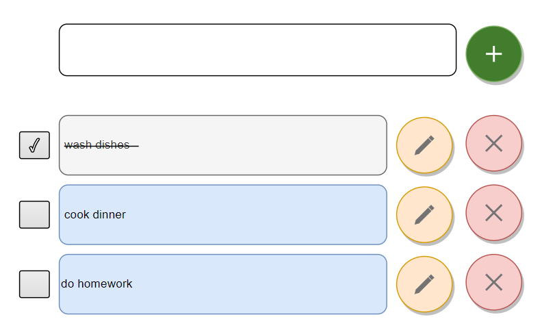

# client-server TODO project

Remember your ToDo project in https://github.com/UAFramework/js-2-3 ?
This time, you need to get your latest version of your client and refactor it,
so that it used server dealing with data.

## Level 1:

### Client side:

Create `client` folder here and put your ToDo front-end code in there.
Here is an example how the UI could possibly look like:



### Server side:

Create `server` folder and initialise it as a node application.
Add necessary dependencies for building REST API server.
In the server code create a global `const` variable where you will keep you todo tasks.
Remember, each Todo task is an object.
Implement api end-points at your server:

- `GET /task` - returns all tasks
- `POST /task` - creates a new task object, adds to the task storage and returns task's object back to the client.
- `PUT /task/:id` - receives an object for the existing task with updated details at the parametrized path. Finds task in the storage by the unique ID, updates it with the new details and returns OK back to the client.
- `DELETE /task/:id` - deletes the task with the given ID and returns OK back to the client.

Where `:id` is the parameter that stands for a unique ID of a Tasks. ID must be unique and programmattically generated. Please use either of the below methods to generate that:

```js
// # 1:
let id = new Date().getTime();
// returns a long number, something like: 1700641068848

// # 2:
let scale = 5;
let id = Math.floor(Math.random() * Math.pow(10, scale)) + Math.pow(10, scale);
// returns number between 10^scale and 10^scale+1 - 1,
// if scale = 5 then number between 100000 and 999999
```

**Pros and Cons of those methods**:

- (+) both are very simple and you don't need to include any third-party code
- (-) both are risky to use in a system with high load (many users of the app per second) - high risk to have a duplicated ID

For now, we assume that the source of truth (source of data) is our front-end.
And so whenever user changes a task at the front-end you use REST api to update/delete the same existing task or create a new task at the server side.

We will change our approach later, though.

## Level 2:

- Use [serve](https://www.npmjs.com/package/serve) to start your front-end as a web server.
- Following this template for [yarn-starter-kit](https://github.com/filkovsp/yarn-starter-kit) make a Monorepo with Yarn out of your project.
- Add Node's [uuid](https://www.npmjs.com/package/uuid) package into the back-end and generate new UUID for each task whenever it's being posted to the server. Assign it to the `id` key-value in each task.
- Refactor `POST /task` end-point to assign a unique ID property to the task and return the whole new task's object as response.
- Refactor client to use id from the server's response as the value of id tag in the newly created task at the front-end side. Whenever client sends POST request to the server, client should wait for the response with the cretaed task, and if response is ok client should take the ID of the task from the response. Client do not generate IDs for the taks. This is server's responsibility.
